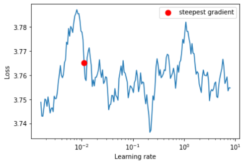
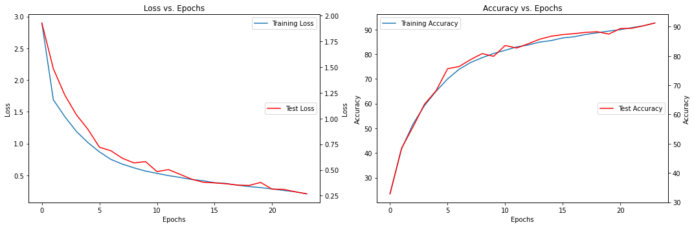

## Assignment

1. Write a custom ResNet architecture for CIFAR10 that has the following architecture:

        1. PrepLayer - Conv 3x3 s1, p1) >> BN >> RELU [64k]

        2. Layer1 -

            1. X = Conv 3x3 (s1, p1) >> MaxPool2D >> BN >> RELU [128k]

            2. R1 = ResBlock( (Conv-BN-ReLU-Conv-BN-ReLU))(X) [128k] 

            3. Add(X, R1)

        3. Layer 2 -

            1. Conv 3x3 [256k]

            2. MaxPooling2D

            3. BN

            4. ReLU

        4. Layer 3 -

            1. X = Conv 3x3 (s1, p1) >> MaxPool2D >> BN >> RELU [512k]

            2. R2 = ResBlock( (Conv-BN-ReLU-Conv-BN-ReLU))(X) [512k]

            3. Add(X, R2)

        5. MaxPooling with Kernel Size 4

        6. FC Layer 

        7. SoftMax
        
2. Uses One Cycle Policy such that:
    1. Total Epochs = 24
    2. Max at Epoch = 5
    3. LRMIN = FIND
    4. LRMAX = FIND
    5. NO Annihilation
3. Uses this transform -RandomCrop 32, 32 (after padding of 4) >> FlipLR >> Followed by CutOut(8, 8)
4. Batch size = 512
5. Target Accuracy: 90% **(93.8% quadruple scores)**. 
6. NO score if your code is not modular. Your collab must be importing your GitHub package, and then just running the model. I should be able to find the custom_resnet.py model in your GitHub repo that you'd be training. 

## Solution

The network starts with a prep_layer that takes a 3-channel image as input and applies a 64-channel convolutional layer, followed by batch normalization and ReLU activation. The output of the prep_layer is passed to the first layer, which applies a 128-channel convolutional layer, followed by max pooling, batch normalization, and ReLU activation. The output is then passed to a ResBlock, which applies two 3x3 convolutional layers, each followed by batch normalization and ReLU activation, and adds the input to the output before applying another ReLU activation.The output of the ResBlock is passed to the second layer, which applies a 256-channel convolutional layer, followed by max pooling, batch normalization, and ReLU activation. The output of the second layer is passed to the third layer, which applies a 512-channel convolutional layer, followed by max pooling, batch normalization, ReLU activation, and another ResBlock.The output of the final ResBlock is passed to a max pooling layer with a kernel size of 4, and then to a fully connected layer with 512 input features and 10 output features, which corresponds to the number of classes in the classification task. The final output is passed through a log softmax function to produce the predicted class probabilities.

### Cyclic Learning Rate

The essence of the learning rate policy comes from the observation that increasing the LR might have a short term negative effect and yet achieve a longer-term beneficial effect. This observation leads to the idea of letting the LR vary within a range of values rather than adopting a stepwise fixed or exponentially decreasing value.

### One Cycle policy

The One Cycle Policy is a learning rate scheduling technique that has been shown to improve the training of deep neural networks. It was introduced by Leslie Smith in 2018 and is based on the idea of training the network using a cyclical learning rate, where the learning rate starts at a low value, increases to a maximum value, and then decreases back to the initial low value.

* Faster training: The One Cycle Policy can help to speed up training by allowing the network to converge faster. By starting with a low learning rate, the network is able to make more gradual changes to the weights, which can help to avoid getting stuck in local minima. Increasing the learning rate later in the training process can help the network to make larger updates to the weights and explore more of the weight space.
* Better generalization: The One Cycle Policy has been shown to improve the generalization of the trained model. By training the network with a cyclical learning rate, the network is forced to explore a larger portion of the weight space, which can help to find better minima that generalize better to new data.
* Regularization: The One Cycle Policy can act as a form of regularization by adding noise to the optimization process. By varying the learning rate, the network is forced to make small changes to the weights, which can help to reduce overfitting.
* Easy to implement: The One Cycle Policy is easy to implement and does not require any additional hyperparameters or complex optimization algorithms. The policy can be applied to any neural network and can be used in conjunction with other optimization techniques, such as weight decay and momentum.

### LR Finder Plot

### Model Training and Results

The model was trained using the above architecture on Cifar10 for 24 epochs. The best train and test accuracy achieved is 92.64% and 91.25% respectively.

**Loss Curves**

