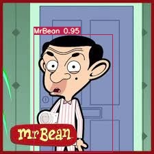

## Problem Statement

1. OpenCV Yolo: [SOURCE](https://pysource.com/2019/06/27/yolo-object-detection-using-opencv-with-python/)  
    1. Run this above code on your laptop or Colab.  
    2. Take an image of yourself, holding another object which is there in COCO data set (search for COCO classes to learn).  
    3. Run this image through the code above.  
    4. Upload the link to GitHub implementation of this  
    5. Upload the annotated image by YOLO. 
    
2. Training Custom Dataset on Colab for YoloV3  
    1. Refer to this Colab File: [LINK](https://colab.research.google.com/drive/1LbKkQf4hbIuiUHunLlvY-cc0d_sNcAgS)
    2. Refer to this GitHub [Repo](https://github.com/theschoolofai/YoloV3)
    3. Download this [dataset](https://drive.google.com/file/d/1sVSAJgmOhZk6UG7EzmlRjXfkzPxmpmLy/view?usp=sharing). This was annotated by EVA5 Students. Collect and add 25 images for the following 4 classes into the dataset shared:  
        1. class names are in custom.names file.   
        2. you must follow exact rules to make sure that you can train the model. Steps are explained in the README.md file on github repo link above.  
        3. Once you add your additional 100 images, train the model  
    4. Once done:  
        1. Download a very small (~10-30sec) video from youtube which shows your classes. 
        2. Use ffmpeg to extract frames from the video.  
        3. Upload on your drive (alternatively you could be doing all of this on your drive to save upload time)
        4. Infer on these images using detect.py file. **Modify** detect.py file if your file names do not match the ones mentioned on GitHub.  
        python detect.py --conf-three 0.3 --output output_folder_name
        5. Use  ffmpeg  to convert the files in your output folder to video
        6. Upload the video to YouTube. 
        7. Also run the model on 16 images that you have collected (4 for each class)  
    5. Share the link to your GitHub project with the steps mentioned above - 1000 pts (only if all the steps were done, and it resulted in a trained model that you could run on video/images)  
    6. Share the link to your YouTube video - 500 pts  
    7. Share the link of your YouTube video shared on LinkedIn, Instagram, medium, etc! You have no idea how much you'd love people complimenting you! [TOTALLY OPTIONAL] - bonus points  
    8. Share the link to the readme file where we can find the result of your model on YOUR 16 images. - 500 pts. 

3. Bonus: [YoloV4 Training on Colab!](https://colab.research.google.com/drive/1b08y_nUYv5UtDY211NFfINY7Hy_pgZDt#scrollTo=1YW7jPF1BOAw). 

## Solution - Part1- OpenCV Yolo
This part of the assignment was more about how to use YOLO with Opencv. This is the best approach for beginners, to get quickly the algorithm working without doing complex installations.

* Link to Colab: [OpenCV Yolo](https://github.com/ak112/TSAI-EVA8.0/blob/master/12_ObjectLocalisation/12_Session_OpenCV.ipynb)

* Annotated Image Yolo

## Part2- Training YoloV3 on Custom Data
This part involved training YoloV3 on custom data.

1. The first step in the process of customizing YOLOv3 for object detection on a custom dataset is to collect and curate the required data. This involves gathering images that contain the objects of interest MrBean, Cybertruck, Oggy, Cockroach and ensuring that the images are of high quality and diverse enough to represent different angles, lighting conditions, and backgrounds.

2. Once the data is collected, it was annotated using appropriate VGG annotation tool to mark the location and class of the objects of interest. The annotations need to be in a format that matches the YOLOv3 requirements, typically in the form of bounding boxes with class labels associated with each object.

3. After the data is annotated, the next step was customize the YOLO configuration file and dataset files to accommodate the custom dataset. This involves modifying the configuration file to adjust the number of classes and filters, updating the class names and train.txt files, and making any other necessary adjustments to the hyperparameters to suit the new dataset.

4. The last layer of the YOLOv3 architecture needs to be modified to match the number of custom classes in the dataset, which in this case is four. The second last layer's filters need to be updated using the formula 3 * (4 + number of classes (4) + 1) = 27. This ensures that the network is optimized for the new dataset.

5. Finally, the model was trained on the custom dataset using PyTorch. The training process involves initializing the network with pre-trained weights from the COCO dataset and then fine-tuning the model on the custom dataset. The resulting customized object detection model was used to detect the objects of interest in test image and video

* Link to Colab: [Custom Yolo](https://github.com/ak112/TSAI-EVA8.0/blob/master/12_ObjectLocalisation/12_Session_Custom_YOLOV3.ipynb)

* Result of model on test images

**MrBean** 

|  |  |
|------------------------|------------------------|
|  |  |

**Cybertruck**

|  |  |
|------------------------|------------------------|
|  |  |

**Oggy** 

|  |  |
|------------------------|------------------------|
|  |  |

**Cockroach** 

|  |  |
|------------------------|------------------------|
|  |  |

* Link to Youtube Video [Cybertruck Object Detection](https://youtu.be/oGUs2zk_z1w)